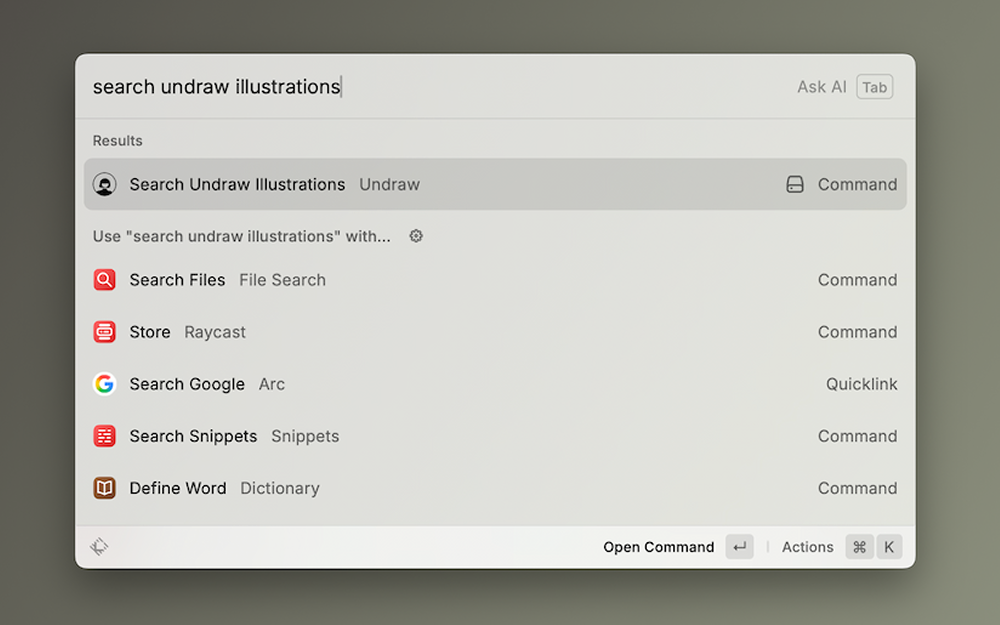
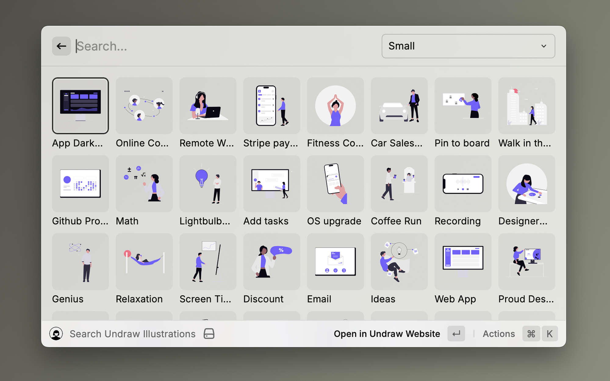
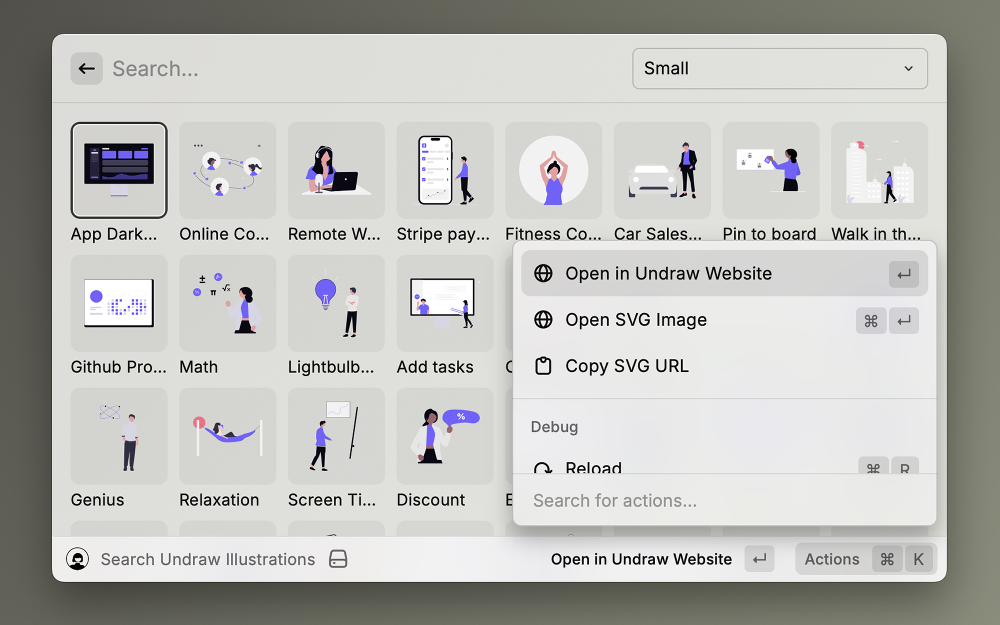

# Raycast x Undraw

A productivity tool for developers and designers, enabling instant search for high-quality Undraw illustrations directly from Raycast and seamless integration with the official website.

- 
- 

## Key Features

* **Fast Illustration Search**: Instantly search all Undraw illustrations by keyword from the Raycast search bar.
* **Quick Preview**: View thumbnail previews of search results directly, allowing for quick visual identification of desired assets.
* **Seamless Integration**: Open illustrations in the official Undraw website or copy SVG URLs directly from Raycast.
* **Data Caching**: Caches illustration metadata locally, allowing for offline search and ensuring consistently fast responses.

## Usage

1.  Invoke Raycast, type `Search Undraw Illustrations`, and press Enter to run the command.
    |  |
    | --- |
2.  As you type keywords into the search bar, relevant Undraw illustrations will appear instantly.
    |  |
    | --- |
3.  Select the desired illustration and press `Enter`, or open the action panel with `⌘K`.
    |  |
    | --- |
4.  Available Actions:
    * **Open in Undraw Website**: Opens the official Undraw website page for the selected illustration in your browser.
    * **Open SVG Image**: Opens the SVG image of the illustration directly in your browser.
    * **Copy SVG URL**: Copies the SVG image URL to your clipboard.

## Settings

* **Grid Item Size**: Choose the display size of illustrations from "Large," "Medium," or "Small."

## License

This Raycast extension is released under the [MIT License](LICENSE).

**Important**: This extension does not redistribute Undraw illustrations or replicate Undraw's service. The copyright of the illustrations belongs to the creator of Undraw. This extension functions as an auxiliary tool to help users efficiently discover and utilize illustrations from the official Undraw website.
